# Lab 2: Scaffold a Web Part

For our second lab, we'll utilize the tooling we made you install and we'll begin working on a web part together. The web part we will be making over the next several labs will be called J.A.R.B.I.S. and will be utilizing a SharePoint list backend to generate random super hero names and icons. Aw Yeah!!

For now, we're going to look at how to scaffold a basic web part and do some quick tweaks (while taking care of a couple minor final configurations along the way).

<details>
<summary>Exercises</summary>

  1. [Scaffold your web part](#rocket-exercise-1-scaffold-your-web-part)
  1. [Attempt to load your web part](#rocket-exercise-2-attempt-to-load-your-web-part)
  1. [Install the self-signed certificate](#rocket-exercise-3-install-the-self-signed-certificate)
  1. [Customize the web part](#rocket-exercise-4-customize-the-web-part)
  1. [Update the manifest](#rocket-exercise-5-update-the-manifest)
</details>

## :rocket: Exercise 1: Scaffold your web part

We've gotten everything installed and we're ready to start working on something! Well, time to use those tools to generate our starter files (also called scaffolding if you're cool).

1. From your command prompt, go to your working folder (the parent folder for the labs).
    > :bulb: As shown in the previous lab, if you closed your command prompt, open the folder in file explorer and type `cmd` in the path to automatically open a command prompt in that directory

1. Create a new folder called `jarbis`. You can use File Explorer or type `mkdir jarbis`

    > :bulb: It's best to keep your path as short as possible; Node projects can end up with very long file paths, and Windows can sometimes report unpredictable issues due to file paths being too long. Plus it makes your command prompt annoyingly long.

1. Change your current folder in the command prompt to the new one by typing `cd jarbis`

1. Once in your fancy new folder, launch the yeoman generator by typing `yo @microsoft/sharepoint`

   > :bulb: There are a few extra parameters you can apply when running the generator. You won't typically use them, but you can always find out what's available by typing `yo @microsoft/sharepoint --help`

1. When prompted for a solution name, leave the default (**jarbis**), followed by <kbd>Enter</kbd>
   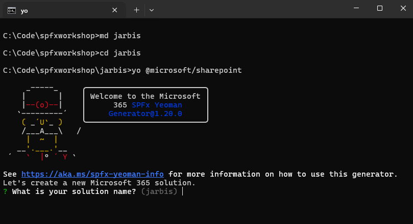  
   > :warning: Verify the SPFx Yeoman Generator version number matches 1.16.1 as shown above (in the super legible dark blue on black text). If it doesn't, or you get an error like "yo not found" then a step was missed in the last lab. Either check your work or reach out for help.

1. When prompted what type of client you'd like to build, select **WebPart**:
   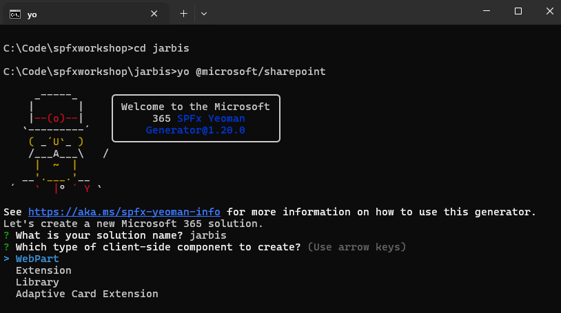
   > :bulb: You can just hit <kbd>Enter</kbd> since it's the default for new projects. In the future, you might be creating a different project type (or rerunning the generator to add a new component to an existing project). In those cases, you will use the up/down arrows to select the correct component type before pressing <kbd>Enter</kbd>. Same will be true for the other "menus"

1. When prompted for a Web Part name, enter **Jarbis**.

1. When prompted for a template, select **No Framework**:
   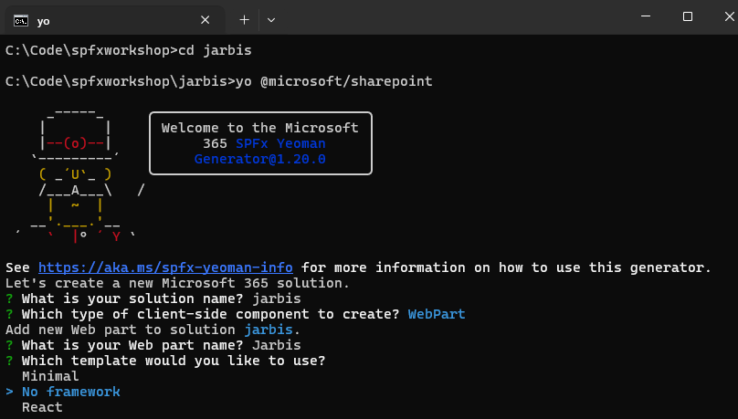

   > :bulb: There are 3 [template options](https://learn.microsoft.com/sharepoint/dev/spfx/yeoman-generator-for-spfx-intro#project-template-options) for web parts. Here's a quick breakdown: 
   
   - **Minimal** - This is a barebones web part with nothing in it. Great for experienced devs who want full control over what's included.
   - **No framework** - Barebones template that includes sample theming and context code. Use this when you want to work with the DOM directly or use frameworks besides React (like jQuery).
   - **React** - same theming and context stuff as the previous, but includes React and wires up an initial component. This is the most common template once you get comfortable with React.

   > :bulb: There's also an [advanced generator provided by PnP](https://pnp.github.io/generator-spfx/) that makes using things like Angular Elements, VueJS, Knockout, etc. easier. Once you're a little more comfortable with the basics, it's definitely worth looking into further!

1. Wait for the solution to be scaffolded (This may take a moment or 75 depending on the network quality).

   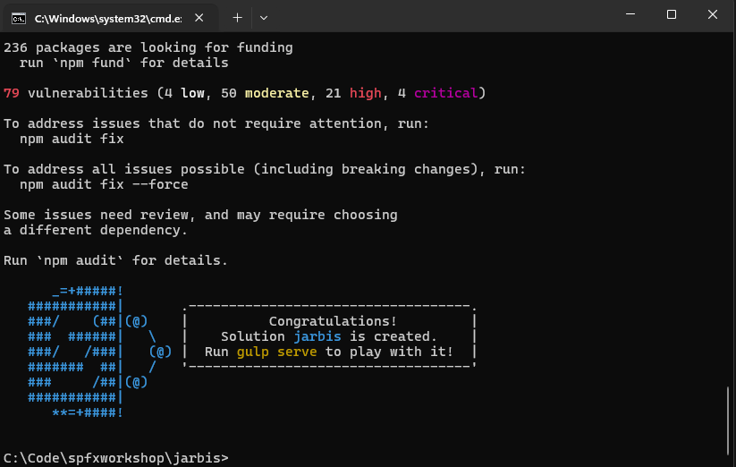

   > :warning: NPM may display warnings and error messages during the installation of dependencies while it runs the `npm install` command. You can safely ignore these log warnings & error messages.
   >
   > NPM may display a message about running `npm audit` at the end of the process. **Don't** run this command as it will upgrade packages and nested dependencies that may not have been tested by the SharePoint Framework

#### :books: Resources
- [Build your first SharePoint client-side web part](https://learn.microsoft.com/sharepoint/dev/spfx/web-parts/get-started/build-a-hello-world-web-part)
- [Yeoman Generator for SPFx](https://learn.microsoft.com/sharepoint/dev/spfx/yeoman-generator-for-spfx-intro)
- [SPFx Yeoman Generator project template options](https://learn.microsoft.com/sharepoint/dev/spfx/yeoman-generator-for-spfx-intro#project-template-options)
- [PnP SPFx Yeoman Generator](https://pnp.github.io/generator-spfx/)


## :rocket: Exercise 2: Attempt to load your web part
We've got some files and we haven't broken them yet, so let's take a look at it (and in doing so take care of the last couple of first time setup tasks).

1. Go to your web browser (using the profile you setup earlier), and navigate to the root site of your Microsoft 365 Dev Tenant (e.g.: <https://yourdevtenant.sharepoint.com>, where _yourdevtenant_ is the name of the Development tenant you created in the first lab.

1. To view the workbench, navigate to `[YOUR_ROOT_SITE_HERE]/_layouts/workbench.aspx`

   > :bulb: The online workbench is actually available on every site in your tenant simply by adding `/_layouts/workbench.aspx` to the site address.

1. You will get an error saying that your web part isn't running... let's fix that!

   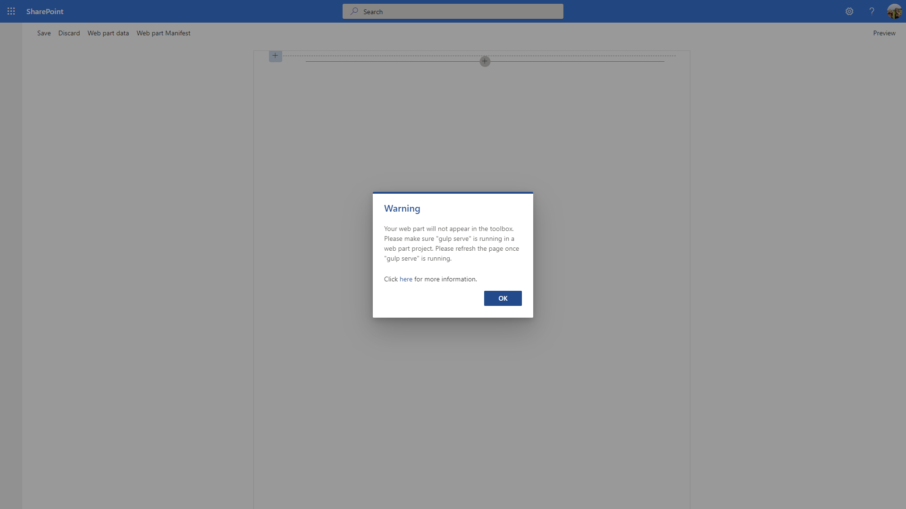

1. Back in the command prompt, type `gulp serve --nobrowser`.

   > :bulb: The `--nobrowser` parameter is optional. By default, `gulp serve` will open a browser window (more details about to where in later exercises). Slapping this parameter on there prevents this since we already opened the workbench and we've probably got too many tabs open as it is.

1. You will likely get an error (unless you've setup your environment previously) about a missing development certificate:

   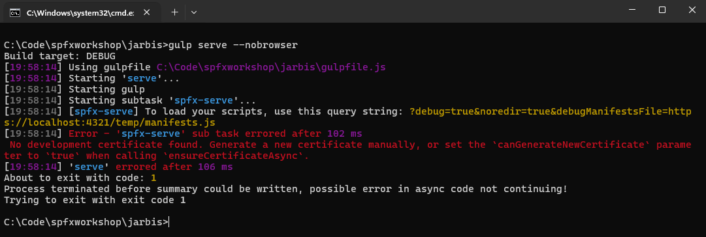

1. Alternatively, you may get it as a warning:

    ```bash
    Warning - [spfx-serve] When serving in HTTPS mode, a PFX cert path or a cert path and a key path must be provided, or a dev certificate must be generated and trusted. If a SSL certificate isn't provided, a default, self-signed certificate will be used. Expect browser security warnings.
    ```

1. If at any point you get a **Windows Security Alert**, select **Allow access**. (though this may not occur until a later step)

   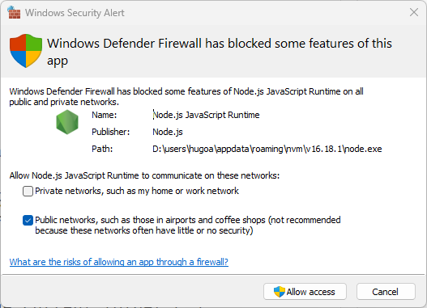  

1. If you don't get any errors or warnings, then you've likely installed the dev certificate previously and safely skip to Exercise 4. Everybody else, let's get it fixed!

#### :books: Resources
 - [An endless horse](http://endless.horse/)


## :rocket: Exercise 3: Install the self-signed certificate

Trusting the developer certificate is required. This is a one-time process and is only required when you run your first SharePoint Framework project on a new workstation. You don't need to do this for every SharePoint Framework project. Yay!

1. In your command prompt, type `gulp trust-dev-cert` and press <kbd>Enter</kbd>

1. When prompted, accept the certificate by selecting **Yes**:

   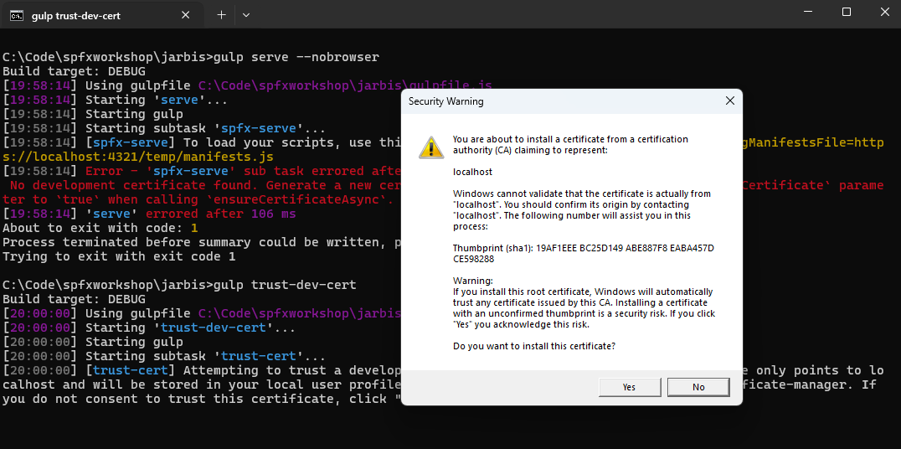

1. Now that we've got the certificate issue fixed, let's try launching again! Launch your web part by typing `gulp serve --nobrowser`

   > The `--nobrowser` part keeps it from launching yet another window
   >
   > "Wait", you may say "all the examples I have seen say to use `gulp serve`... are you teaching me the wrong thing?"
   >
   > `gulp serve` looks at  your **config/serve.json** and launches your default browser to the URL found in `initialPage`.
   >
   > ```json
   > "initialPage": "https://enter-your-SharePoint-site/_layouts/workbench.aspx"
   > ```
   >
   > You're welcome to update your dev tenant URL where it says `enter-your-SharePoint-site`, but if you're using different credentials (or a different browser profile) for your dev tenant, you'll almost invariably get an "Access denied" error, which will cause you to have to close the browser/tab every time.
   >
   > By using `gulp serve --nobrowser`, you can connect to an existing browser/tab instance without launching a new session every single time.
   >
   > For the rest of this workshop, feel free to use `gulp serve` where we use `gulp serve --nobrowser` if  that is what you prefer.

1. Remember, if you get the Firewall access message shown above, click **Allow Access**.
Wait for a message saying `Finished subtask 'reload'`:

   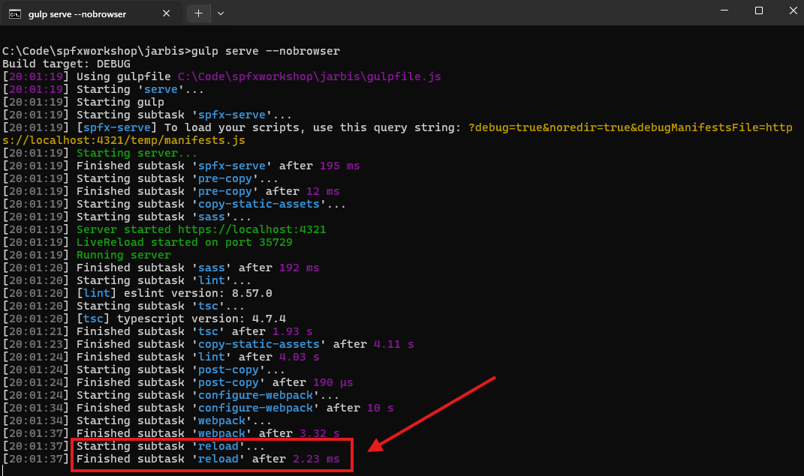  

1. Back in the browser, refresh the workbench page. Your web part should be available to add to your browser (the warning from before won't show up).

1. Test the web part by adding it to the page (click the plus icon and select Jarbis)

   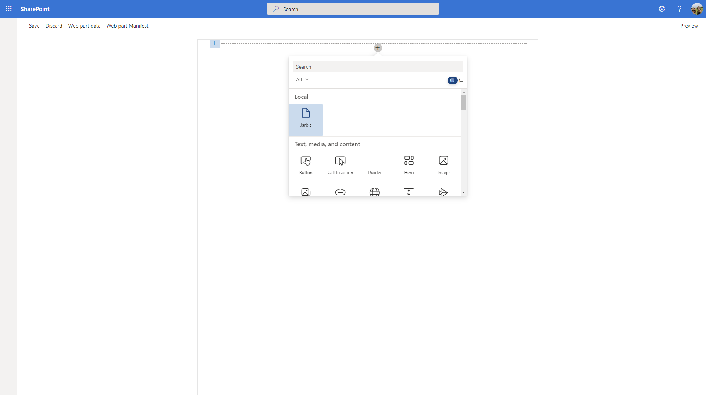

1. Look at your glorious web part! Fortunately, your's won't say Hugo Bernier!

   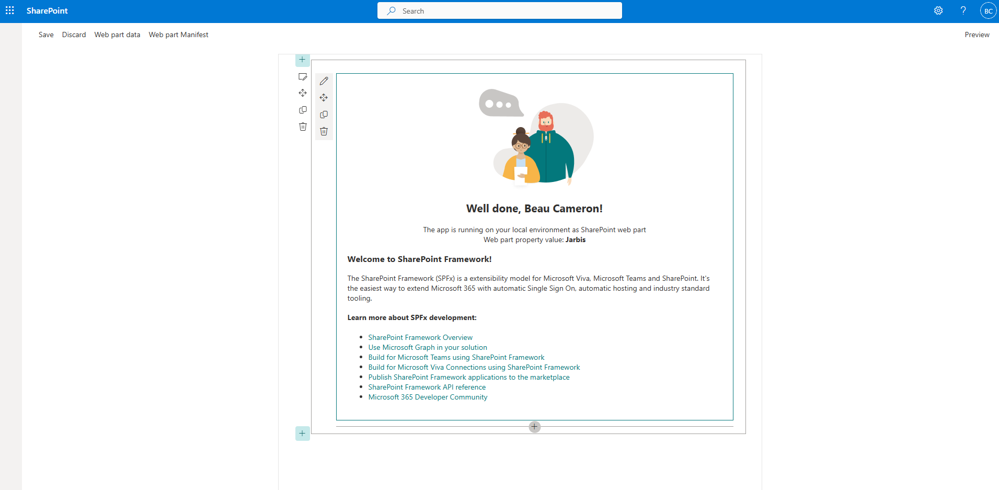

1. Head back to the command prompt and hit <kbd>CTRL</kbd>+<kbd>C</kbd> to stop the code from running:

   

> :bulb: You'll be using this workbench page _a lot_ in this workshop -- and throughout your SPFx development career; we recommend that you bookmark your workbench page within your dev tenant browser profile, or mark it as your start page.

#### :books: Resources
- [SPFx developer certificate instructions](https://learn.microsoft.com/sharepoint/dev/spfx/set-up-your-development-environment#trusting-the-self-signed-developer-certificate)


## :rocket: Exercise 4: Customize the web part

If all you wanted was a web part that welcomes you to the SharePoint Framework and provides some links then I guess you're all done! For everybody else, let's start tweaking this thing!

1. From the command prompt, type `code .` to open Visual Studio Code (code) in the current folder (.)

1. Once in VS Code, launch the terminal window by hitting <kbd>CTRL</kbd>+<kbd>SHIFT</kbd>+<kbd>`</kbd>.

1. Using the explorer pane, expand the **src** folder, followed by the **webparts** folder, and open the **JarbisWebPart.ts** file. On line 32, change `Welcome to SharePoint Framework!` to `Wowee!!`. Save the file.

1. In the terminal, type `gulp serve --nobrowser`

   

   > :bulb: Now that we're in VS Code, we can use the integrated terminal rather than the command prompt from before. It's doing the same thing, but it's far easier to keep an eye on this way. You can feel free to close the command prompt from before.

1. Refresh the browser to see if your web part changed. If it hasn't, make sure the terminal shows the `Starting subtask 'reload'` as it can take a few more seconds than you might expect on initial serve.
     

#### :books: Resources
 - [VS Code Terminal Basics](https://code.visualstudio.com/docs/terminal/basics)
 - [Inspiration](https://screenmessage.com/spfxheroes)

## :rocket: Exercise 5: Update the manifest

Generic icons are not cool! Nor are generic descriptions. In this exercise, we'll update web part manifest, which is used to control the various web part attributes like the title, description, icon, and much more.

> :warning: ALWAYS DO THIS. You can change the info later should you need to, but get something in there from the beginning. There are far too many web parts out there with the generic icon and it makes Vesa cry himself to sleep. Why you wanna make Vesa cry?!?

1. In Visual Studio Code, open the **JarbisWebPart.manifest.json** (located under **src\webparts\jarbis**)

   > :warning: This file (like most of the .json files included in SPFx) contains comments and this angers VS Code since those aren't technically allowed. The good news is that it won't hurt a thing and you can just let VS Code underline the comments to its heart's content while secretly giggling to yourself about how silly it's being

1. Look for the `officeFabricIconFontName` and replace the `Page` value to `Robot`

   > There are actually 2,000+ icons out there and you can use whatever one you want. You can find additional icons at https://flicon.io

   

   > The Fluent UI icons are what you'll probably use most of the time, SPFx does allow you to specify your own images as either an external URL (no thanks) or as a base-64 encoded image (choose this)

1. Change the `description` to `Just A Rather Basic Instructional Solution`

   

   > :bulb: The weird `: { "default": "blah blah" }` syntax can be used for localization of these properties. For now, we're setting the default value that will be used for any languages not specified (which is all of them in our case).

1. Change the `title` to `J.A.R.B.I.S.` because that's cooler and it would have made some of the automatic file naming weird had we done it in the generator from the start.

1. Save your file. If the terminal is still open and still running the last `gulp serve` you'll see magic things happening as the project rebuilds automatically. Unfortunately, changes to the manifest don't get updated like changes to code do and we have to stop (<kbd>CTRL</kbd>+<kbd>C</kbd>) and re-serve (`gulp serve --nobrowser`) - but that magic will be awesome later!

1. If you closed the terminal before, launch the terminal window by hitting <kbd>CTRL</kbd>+<kbd>SHIFT</kbd>+<kbd>`</kbd>.
   > You can also go to the Terminal menu and choose New Terminal

1. If you stopped serving the web part before, type `gulp serve --nobrowser` in the terminal.

1. Back in the browser, click Discard in the upper left to reset the workbench. Refresh the page.

1. Add your webpart again and look for your new icon in your list of web parts available to add (the description will show up as a tooltip).

   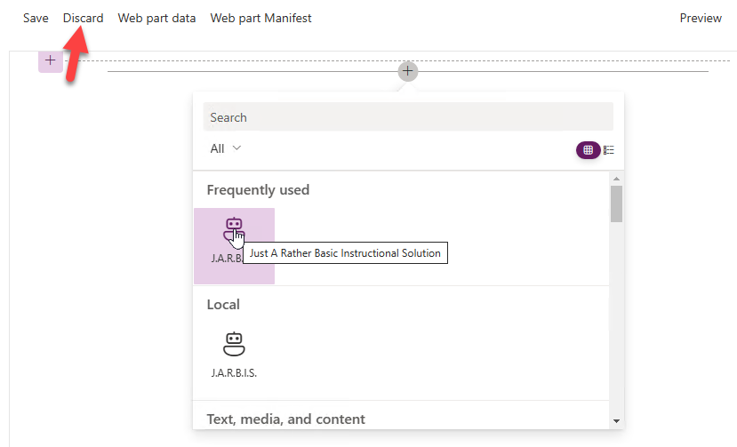

#### :books: Resources
- [Flicon](https://flicon.io)
- [SPFx Configure web part icon](https://learn.microsoft.com/en-us/sharepoint/dev/spfx/web-parts/basics/configure-web-part-icon)
- [Example of using animated Christopher Walken with Googly Eyes](https://thechriskent.com/2017/06/01/setting-your-spfx-webpart-icon/)