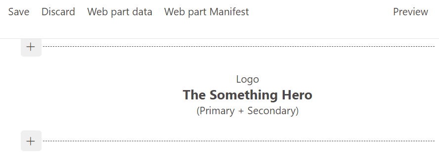

# Lab 3: Introduction to SCSS in SPFx 

Now it's time to talk about what we're actually drawing (HTML) and how it gets all pretty (CSS)!

## Exercise 1: Basic styles

SPFx uses SCSS files for style modules. These allow you to write fancy CSS!

1. From Visual Studio Code, open **JarbisWebPart.ts** and replace the code with the following:

    ```typescript
    import { Version } from '@microsoft/sp-core-library';
    import {
      IPropertyPaneConfiguration,
      PropertyPaneTextField
    } from '@microsoft/sp-property-pane';
    import { BaseClientSideWebPart } from '@microsoft/sp-webpart-base';
    
    import styles from './JarbisWebPart.module.scss';
    import * as strings from 'JarbisWebPartStrings';
    
    export interface IJarbisWebPartProps {
      description: string;
    }
    
    export default class JarbisWebPart extends BaseClientSideWebPart<IJarbisWebPartProps> {
    
      public render(): void {
        this.domElement.innerHTML = `
          <div class="${styles.jarbis}">
            <div>
              Logo
            </div>
            <div>
              The Something Hero
            </div>
            <div>
              (Primary + Secondary)
            </div>
          </div>`;
      }
    
      protected get dataVersion(): Version {
        return Version.parse('1.0');
      }
    
      protected getPropertyPaneConfiguration(): IPropertyPaneConfiguration {
        return {
          pages: [
            {
              header: {
                description: strings.PropertyPaneDescription
              },
              groups: [
                {
                  groupName: strings.BasicGroupName,
                  groupFields: [
                    PropertyPaneTextField('description', {
                      label: strings.DescriptionFieldLabel
                    })
                  ]
                }
              ]
            }
          ]
        };
      }
    }
    ```

1. If you aren't already doing so, run `gulp serve --nobrowser` and refresh the page to see your changes. You can keep gulp serve running and refresh the page after every step in this lab so you can understand the impact of every change.
1. Open the **JarvisWebPart.module.scss** and replace the content with:

    ```scss
    @import '~@microsoft/sp-office-ui-fabric-core/dist/sass/SPFabricCore.scss';

    .jarbis {
      .logo {
        color: inherit;
      }
    
      .name {
        color: inherit;
      }
    
      .powers {
        color: inherit;
      }
    }
    ```

1. Within the `render` method, look for `<div>` elements and add a CSS class by adding the following attribute `class="${ styles.yourclassgoeshere }"`. The render method should look as follows:
   ```typescript
   public render(): void {
    this.domElement.innerHTML = `
          <div class="${styles.jarbis}">
            <div class="${ styles.yourclassgoeshere }">
              Logo
            </div>
            <div class="${ styles.yourclassgoeshere }">
              The Something Hero
            </div>
            <div class="${ styles.yourclassgoeshere }">
              (Primary + Secondary)
            </div>
          </div>`;
    >
   }
   ```

   > You may get some error messages as you edit the method, but we'll fix them soon -- don't worry

3. Rename each `yourclassgoeshere` respectively to `logo`, `name`, `powers`. The `render` method should now look as follows:
   ```typescript
      public render(): void {
        this.domElement.innerHTML = `
              <div class="${styles.jarbis}">
                <div class="${ styles.logo }">
                  Logo
                </div>
                <div class="${ styles.name }">
                  The Something Hero
                </div>
                <div class="${ styles.powers }">
                  (Primary + Secondary)
                </div>
              </div>`;
      }
   ```

## Exercise 2: Fancy styles

1. For the next few steps, make the changes to the **JarvisWebPart.module.scss**, save your changes and monitor how it affects your web part by refreshing your page.
1. To the `.jarbis` class, add the following CSS code: 

    ```scss
      color: "[theme:bodyText, default: #323130]";
      color: var(--bodyText);
      display: flex;
      flex-direction: column;
      align-items: center;
    ```

1. To the `.name` class, replace the existing style with:

   ```scss
    font-weight: bold;
    font-size: 18px;
   ```

1. To the `.powers` class, replace the existing style with:

   ```scss
    color: ms-color-neutralSecondary;
    font-size: 14px;
   ```

1. The final **JarbisWebPart.module.scss** should look like this:
   
   ```scss
    @import '~@microsoft/sp-office-ui-fabric-core/dist/sass/SPFabricCore.scss';
    
    .jarbis {
      color: "[theme:bodyText, default: #323130]";
      color: var(--bodyText);
      display: flex;
      flex-direction: column;
      align-items: center;
    
      .logo {
        color: inherit;
      }
    
      .name {
        font-weight: bold;
        font-size: 18px;
      }
    
      .powers {
        color: ms-color-neutralSecondary;
        font-size: 14px;
      }
    }
  ```

1. Refresh the workbench. Your web part should start looking better!



