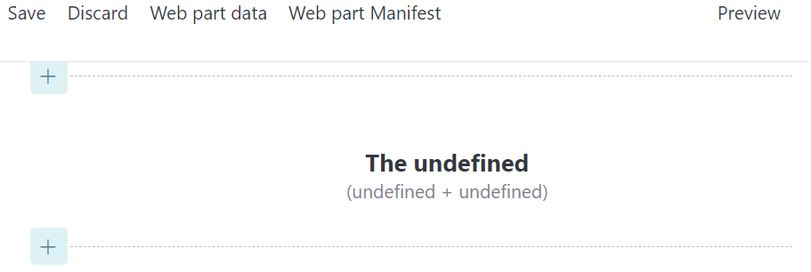
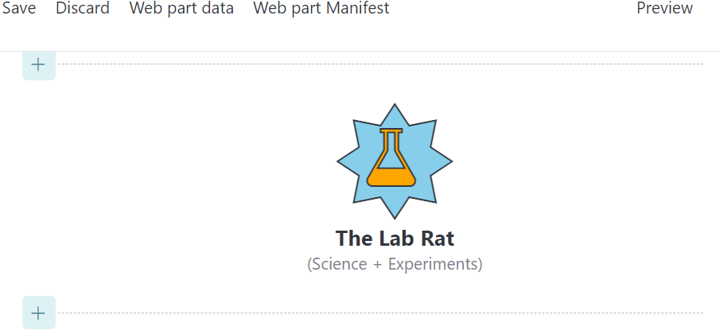
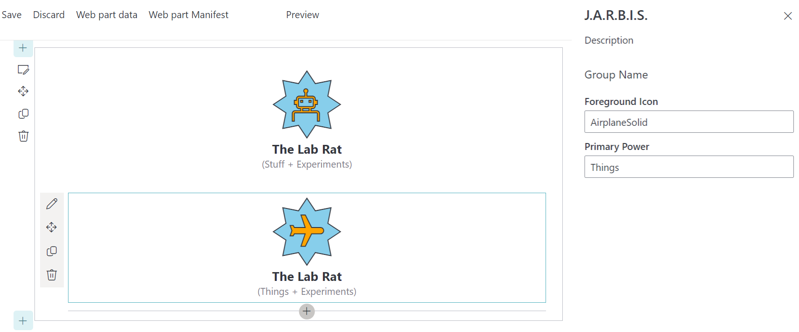

# Lab 5: Property Integration

In this lab, we will look at storing values in our web part instance's properties. This allows us to have unique values per instance. We'll also eventually be pulling in data from a list and by pulling previously retrieved values from our properties, we can ensure we only retrieve list items when someone is editing the web part.

We'll also look at how to customize the property pane and some important considerations when letting end users change your properties.

<details>
<summary><b>Legend</b></summary>

|Icon|Meaning|
|---|---|
|:rocket:|Exercise|
|:apple:|Mac specific instructions|
|:shield:|Admin mode required|
|:bulb:|Hot tip!|
|:hedgehog:|Code catch-up|
|:warning:|Caution!|
|:books:|Resources|

</details>

<details>
<summary><b>Exercises</b></summary>

  1. [Property plumbing](#rocket-exercise-1-property-plumbing)
  1. [Icon mapping](#rocket-exercise-2-icon-mapping)
  1. [Working with the property pane](#rocket-exercise-3-working-with-the-property-pane)
  1. [Escaping properties](#rocket-exercise-4-escaping-properties)
</details>

<details>
<summary><b>Starter Code</b></summary>

If you skipped the previous step, or just want to start here, you can find the code ready to go in the [Lab 05 Starter](https://github.com/SPFxHeroes/J.A.R.B.I.S./tree/Start-of-Lab-05) branch.

</details>

## :rocket: Exercise 1: Property plumbing

The SharePoint Framework provides a web part property bag that will persist a JSON object server side for your web part's instance. These are referred to as **Client-side properties** and the loading/saving of these are all handled for you. In code, we just use `this.properties` to work with them and the magic happens.

There are some lifecycle events (`onBeforeSerialize`, `onAfterDeserialize`) that you could use in advanced scenarios, but generally you define an interface for what the properties should look like and you just use them.

> :bulb: A common misconception is that you can use these for personalization. All users will see the same configuration for a particular web part (properties are per instance, not per user). There are many ways to provide personalization, but it's generally not with your properties.

We'll be sticking with barebones configuration for our properties (that's all we need anyway), but you can actually tell SharePoint a few things about your properties that can enable things searchability, link fixing, and more by using `propertiesMetadata`. That's beyond the scope of this lab, but see the links below if you're interested.

Let's change the `IJarbisWebPartProps` interface to cache all the values we retrieve from the list; that way, we will not need to reload the data every time the web part is displayed -- only when we force generate a new logo.

1. In **JarbisWebPart.ts**, change the `IJarbisWebPartProps` (right below the import statements) and rename the sample property `description` to `name`, so that your interface looks like this:

    ```typescript
    export interface IJarbisWebPartProps {
      name: string;
    }
    ```

1. Using the example of the `name` property, add the following properties to the `IJarbisWebPartProps` interface. All properties will be `string` typed.
  
    - `primaryPower`
    - `secondaryPower`
    - `foregroundColor`
    - `backgroundColor`
    - `foregroundIcon`
    - `backgroundIcon`

    Your final `IJarbisWebPartProps` should look like this:

    ```typescript
    export interface IJarbisWebPartProps {
      name: string;
      primaryPower: string;
      secondaryPower: string;
      foregroundColor: string;
      backgroundColor: string;
      foregroundIcon: string;
      backgroundIcon: string;
    }
    ```

1. The **.manifest.json** file for a web part defines the values that a web part should use when a new web part is dropped on a page including the default values for your properties (they'll be `undefined` otherwise). Let's set some default values so that our users don't get an error when they first use our web part. In the **JarbisWebPart.manifest.json**, find the `properties` node, located under `preConfiguredEntries` and replace the `description` property (which is no longer used) with the following default values:

    ```json
    "name": "Lab Rat",
    "primaryPower": "Science",
    "secondaryPower": "Experiments",
    "foregroundColor": "orange",
    "backgroundColor": "skyblue",
    "foregroundIcon": "TestBeakerSolid",
    "backgroundIcon": "StarburstSolid"
    ```

1. Back in the **JarbisWebPart.ts** file, let's change the `render` method to use our properties. Replace the static value of `The Something Hero` with `The ${this.properties.name}`

1. Replace the word `Primary` with `${this.properties.primaryPower}` (don't overwrite the opening parenthesis)

1. Replace the `Secondary` power with `${this.properties.secondaryPower}` (don't overwrite the closing parenthesis)

1. The full line should now look as follows:

    ```typescript
    (${this.properties.primaryPower} + ${this.properties.secondaryPower})
    ```

1. Replace the hard-coded `skyblue` with `${this.properties.backgroundColor}`

1. Replace the `orange` with `${this.properties.foregroundColor}`

1. Your render method should now look like this:
   ```TypeScript
   public render(): void {
    this.domElement.innerHTML = `
      <div class="${styles.jarbis}">
        <div class="${styles.logo} ${icons.heroIcons}">
          <i class="${icons.iconShieldSolid} ${styles.background}" style="color:${this.properties.backgroundColor};"></i>
          <i class="${icons.iconFavoriteStarFill} ${styles.foreground}" style="color:${this.properties.foregroundColor};"></i>
        </div>
        <div class="${styles.name}">
          The ${this.properties.name}
        </div>
        <div class="${styles.powers}">
          (${this.properties.primaryPower} + ${this.properties.secondaryPower})
        </div>
      </div>`;
   }
   ```

#### :books: Resources
- [Integrate web part properties with SharePoint](https://learn.microsoft.com/en-us/sharepoint/dev/spfx/web-parts/guidance/integrate-web-part-properties-with-sharepoint)


## :rocket: Exercise 2: Icon mapping

TypeScript is an awesome language (though it might still seem a little confusing). One of the best things about TypeScript is, no surprise, it's type system! This lets us spot bugs during development which is always preferrable to runtime.

There can be some drawbacks, however, in that we need to correctly use our types in order for things to build. Ok, drawback is the wrong word. It can be hard sometimes. That's all, it can make some things way easier but others far harder.

Our `icons` object defines a series of properties that map to our classes. We generally access those using dot-notation like this:
```TypeScript
icons.iconShieldSolid
```

We can also access them by index using a string literal like this:
```TypeScript
icons["iconShieldSolid"]
```

So, you might, understandably, think this would work:
```TypeScript
icons["icon" + this.properties.backgroundIcon]
```

WRONG! Dang it, what gives? You'll end up with an error along the lines of *Element implicitly has an 'any' type because blah blah blah has no index signature.* Ok, what?

Basically, TypeScript is able to figure out the string literal mapping and verify it during build, but the moment you introduce a value that will be constructed at runtime it is no longer able to verify you will get an expected result and so it freaks out. While this makes sense, it's also annoying.

Fortunately, TypeScript is smart enough that if we prove we did the type validation ourselves before we use something, it'll let it pass. So, we need a couple of helper functions to do exactly that.

1. Still in **JarbisWebPart.ts** let's add these methods right below our `render` method:
```TypeScript
  private getIconClass(iconName: string): string | undefined {
    const iconKey: string = "icon" + iconName;
    if(this.hasKey(icons, iconKey)) {
      return icons[iconKey];
    }
  }

  private hasKey<O extends object>(obj: O, key: PropertyKey): key is keyof O {
    return key in obj;
  }
```
> :bulb: This is some voodoo TypeScript magic and is a little more complicated than makes sense to get into here. Fortunately, there's a link below that goes into more detail. For now, just accept the ironclad "Trust me, bro" reasoning 🤣

Now we can make our icons use our property values just like the other stuff!

1. Replace `icons.iconShieldSolid` with `this.getIconClass(this.properties.backgroundIcon)`

1. Replace `icons.iconFavoriteStarFill` with `this.getIconClass(this.properties.foregroundIcon)`

1. Here's what your `render` method should look like:
    ```typescript
    public render(): void {
      this.domElement.innerHTML = `
        <div class="${styles.jarbis}">
          <div class="${styles.logo} ${icons.heroIcons}">
            <i class="${icons.iconShieldSolid} ${styles.background}" style="color:${this.properties.backgroundColor};"></i>
            <i class="${icons.iconFavoriteStarFill} ${styles.foreground}" style="color:${this.properties.foregroundColor};"></i>
          </div>
          <div class="${styles.name}">
            The ${this.properties.name}
          </div>
          <div class="${styles.powers}">
            (${this.properties.primaryPower} + ${this.properties.secondaryPower})
          </div>
        </div>`;
    }
    ```

If you had `gulp serve` running and simply refresh the page, you may see that some of the values return as `undefined`. This is because the web part was added to the page before the **.manifest.json** was updated and the web part rebuilt (no default values).



You'll need to stop and start `gulp serve` to get the manifest updates included and then remove the current instance of the web part, and add a new instance to the workbench. The default values should now appear -- instead of `undefined`.



#### :books: Resources
- [Indexing objects in TypeScript](https://dev.to/mapleleaf/indexing-objects-in-typescript-1cgi)

## :rocket: Exercise 3: Working with the property pane

Wow! Now our hardcoded values are hardcoded in a different spot!

Just kidding, that's only because we haven't implemented any logic to change them. Remember, the values in the manifest are only the default values. Let's demonstrate how the values are dynamically bound by using the property pane.

1. In the **JarbisWebPart.ts** file, find the `getPropertyPaneConfiguration` method -- this is the method that every web part uses when asked to display the configuration property pane (that side panel of options when editing a web part).

1. The `PropertyPaneTextField` is currently bound to the `description` property, which isn't a thing anymore. Change it to bind to the `foregroundIcon` instead and change the `label` property to `"Foreground icon"`

1. Add another `PropertyPaneTextField` to bind to the `primaryPower` and set the label to `"Primary Power"`.

1. The full `getPropertyPaneConfiguration` should now look as follows:

   ```typescript
   
      protected getPropertyPaneConfiguration(): IPropertyPaneConfiguration {
        return {
          pages: [
            {
              header: {
                description: strings.PropertyPaneDescription
              },
              groups: [
                {
                  groupName: strings.BasicGroupName,
                  groupFields: [
                    PropertyPaneTextField('foregroundIcon', {
                      label: "Foreground Icon"
                    }),
                    PropertyPaneTextField('primaryPower', {
                      label: "Primary Power"
                    })
                  ]
                }
              ]
            }
          ]
        };
      }
   ```

1. Run `gulp serve` and try changing some of the web part properties. For example, try entering `AirplaneSolid` or `Robot` in the **Foreground icon** field. You should see the web part refresh every time you change the icon.

1. Try adding another instance of the web part on the page and change the settings for that web part. You'll notice that the settings of each web part are independent from each other.



#### :books: Resources
- [Make your SharePoint client-side web part configurable](https://learn.microsoft.com/en-us/sharepoint/dev/spfx/web-parts/basics/integrate-with-property-pane)
- [Reactive and nonreactive SharePoint web parts](https://learn.microsoft.com/en-us/sharepoint/dev/design/reactive-and-nonreactive-web-parts)
- [PnP Property Pane Controls](https://pnp.github.io/sp-dev-fx-property-controls/)

## :rocket: Exercise 4: Escaping properties

You can validate property pane inputs by providing a callback to the `onGetErrorMessage` property when you configure your PropertyPane controls. This lets you do things like ensure it's not empty, min values, max values, length, etc. You can also call out to an external service to validate things if required.

Since we plan to work with these values from lists rather than end users, we're less concerned about it now but there's a link below explaining how to do this.

However, as a general rule, you should always verify input provided by users to ensure that malicious code is not executed by your web parts. Frameworks such as React are going to do this for you, but when you're building your HTML through string concatenation like we are, it's our job. This is something we want to do before using a value since it's possible (although uncommon) to set property values outside of the property pane.

In this exercise, we'll demonstrate why you should always escape values that can be stored or entered by users before you display them on the screen.

1. While still running `gulp serve`, change the **Primary Power** of any of your currently added web parts to `<span style='color:red'>Science</span>` and observe what happens in the page.
   
   > :bulb: Injecting custom HTML is arguably tame, but the same technique could be used to inject custom JavaScript for malicious intent.

1. At the top of **JarbisWebPart.ts**, insert the following import:

   ```typescript
   import { escape } from '@microsoft/sp-lodash-subset';
   ```

1. Replace the code where you display the value of the `primaryPower` (`${this.properties.primaryPower}`) to call the `escape` function before rendering the value with the following code:

   ```typescript
   ${escape(this.properties.primaryPower)}
   ```

1. Refresh the web part. You'll notice that the "malicious HTML" is now escaped and rendered as harmless text instead of HTML.
   

1. Add `escape` to all displayed properties. The final `render` method should look as follows:

    ```typescript
    public render(): void {
     this.domElement.innerHTML = `
      <div class="${styles.jarbis}">
        <div class="${styles.logo} ${icons.heroIcons}">
          <i class="${this.getIconClass(escape(this.properties.backgroundIcon))} ${styles.background}" style="color:${escape(this.properties.backgroundColor)};"></i>
          <i class="${this.getIconClass(escape(this.properties.foregroundIcon))} ${styles.foreground}" style="color:${escape(this.properties.foregroundColor)};"></i>
        </div>
        <div class="${styles.name}">
          The ${escape(this.properties.name)}
        </div>
        <div class="${styles.powers}">
          (${escape(this.properties.primaryPower)} + ${escape(this.properties.secondaryPower)})
        </div>
      </div>`;
   }
   ```
#### :books: Resources
- [Validate web part property values](https://learn.microsoft.com/en-us/sharepoint/dev/spfx/web-parts/guidance/validate-web-part-property-values)


## :tada: All Done!


In our next lab, we'll look at how we can make our rendering conditional based on the state of the page!

# [Previous](../Lab04/README.md) | [Next](../Lab06/README.md)