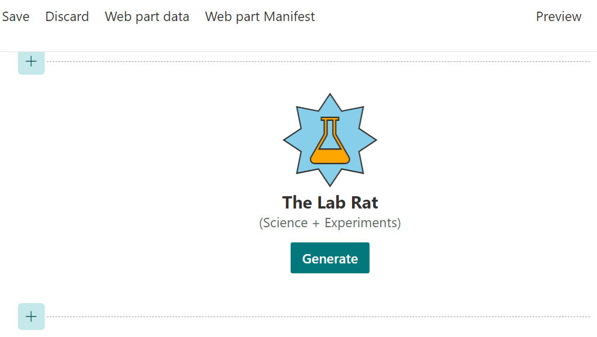
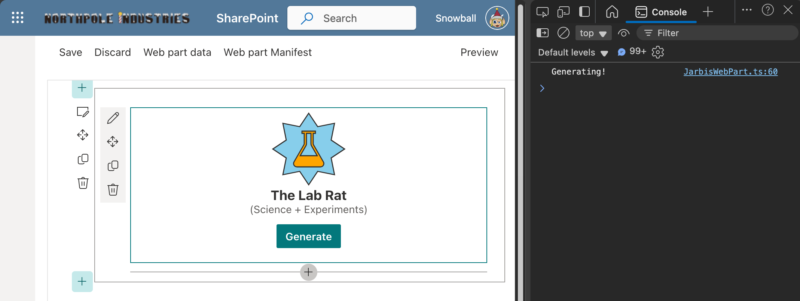

# Lab 7: Event Handlers

In the previous lab, we added a useless button. In this lab, we're wiring up the button event handler to make it more useful!

<details>
<summary><b>Legend</b></summary>

|Icon|Meaning|
|---|---|
|:rocket:|Exercise|
|:apple:|Mac specific instructions|
|:shield:|Admin mode required|
|:bulb:|Hot tip!|
|:hedgehog:|Code catch-up|
|:warning:|Caution!|
|:books:|Resources|

</details>

<details>
<summary><b>Exercises</b></summary>

  1. [Make that button pretty](#rocket-exercise-1-make-that-button-pretty)
  1. [Attach an event to the button](#rocket-exercise-2-attach-an-event-to-the-button)
</details>

<details>
<summary><b>Starter Code</b></summary>

If you skipped the previous step, or just want to start here, you can find the code ready to go in the [Lab 07 Starter](https://github.com/SPFxHeroes/JARBIS/tree/Start-of-Lab-07) branch.

</details>

## :rocket: Exercise 1: Make that button pretty

Not only is our button not doing anything, it's gross to look at (like Hugo). So, let's add some style to it and make it look fancy (like Chris)!

1. In the **JarbisWebPart.module.scss**, add the following code below the `.powers` block but still nested within the `.jarbis` class:

   ```SCSS
   .generateButton {
      margin: 12px;
      background-color: "[theme:themePrimary, default: #a4262c]";
      color: "[theme:white, default: #ffffff]";
      border: none;
      border-radius: 2px;
      height: 32px;
      font-size: 14px;
      padding: 0 12px;
      font-weight: 600;
      cursor: pointer;
    
      &:hover {
        background-color: "[theme:themeDarkAlt, default: #932227]";
      }

      &:active {
        background-color: "[theme:themeDark, default: #7c1d21]";
      }
   }
   ```
   > :bulb: You might have noticed we're using a theme color for white. That seems dumb until you realize that SharePoint will actually substitute black when you use white in a dark mode theme. So, it's not that using a theme value for white is dumb, it's the name of the semantic slot that's dumb.

   > :bulb: What are those `&` symbols doing? In SCSS, the `&` is a parent selector used in nested selectors to refer to the outer selector. This makes it easier to directly reference the class you're nested in. See the link below for more details.

1. In the web part's `render` method, change the `const generateButton...` line to have a class attribute so that it look like this:

    ```typescript
    const generateButton = `<button class="${styles.generateButton}">Generate</button>`;
    ```

1. Refresh your browser and admire the beautiful fancy button.



> :bulb: Your button might be a different color depending on your site's theme (which is what we want)

#### :books: Resources
- [Available theme tokens and their occurrences](https://learn.microsoft.com/en-us/sharepoint/dev/spfx/use-theme-colors-in-your-customizations#available-theme-tokens-and-their-occurrences)
- [SCSS Parent Selector (&)](https://sass-lang.com/documentation/style-rules/parent-selector)


## :rocket: Exercise 2: Attach an event to the button

A fancy button that does nothing is even more disappointing than an ugly one that does nothing. Probably. So let's create a function that fires when a user clicks it.

Since we're handling the lifecycle of our generated HTML, we also have to handle adding/removing listeners. We'll end up adding them and removing them on every render to avoid creating memory leaks in the browser (unlikely in a modern browser, but still best practice).

1. In the **JarbisWebPart.ts**, add the following function below the `render` method:

   ```TypeScript
    private onGenerateHero = (event: MouseEvent): void => {
        console.log('Generating!');
    }
   ```
  > The function does nothing useful yet (it only displays a message on the Developer console), but we'll add functionality soon enough!
  
1. Within the `render` method, add the following code after the last line of code:
   ```TypeScript
    const buttons = this.domElement.getElementsByClassName(styles.generateButton);
    for (let b = 0; b < buttons.length; b++) {
      buttons[b].addEventListener('click', this.onGenerateHero);
    }
   ```
   > :bulb: This code finds all the buttons matching the `generateButton` CSS class name and adds an event handler for the `click` event. If there aren't any found (page is in Read mode), then nothing will happen.

1. At the top of the `render` method, before all the code, add the following:
    ```TypeScript
    const oldbuttons = this.domElement.getElementsByClassName(styles.generateButton);
    for (let b = 0; b < oldbuttons.length; b++) {
      oldbuttons[b].removeEventListener('click', this.onGenerateHero);
    }
    ```
    > :bulb: This code removes any existing event handlers before the web part is rendered; this is to prevent adding duplicate event handlers when the web part is refreshed.

1. Add the following code below the `onGenerateHero` method:
    ```TypeScript
    protected onDispose(): void {
      const oldbuttons = this.domElement.getElementsByClassName(styles.generateButton);
      for (let b = 0; b < oldbuttons.length; b++) {
        oldbuttons[b].removeEventListener('click', this.onGenerateHero);
      }
    }
    ```
    > :bulb: This code will remove event handlers from every button when the web part is being destroyed (or _disposed_). The `onDispose` method is another lifecycle event you can take advantage of in your web part to do any final cleanup.

1. Refresh your browser and try opening the Developer tools in your browser, using <kbd>F12</kbd> or <kbd>CTRL</kbd>+<kbd>SHIFT</kbd>+<kbd>I</kbd> on your keyboard, or by using the **Settings and more** ellipsis icon, then **More tools** > **Developer Tools**.

1. Try hitting the button and see that the `console.log` entries are written in the Developer tools' console.
     

If you run into any trouble or don't really want to do the steps above, you can just replace the entire contents of the **JarbisWebPart.ts** file with the following:

<details>
<summary>:hedgehog: JarbisWebPart.ts</summary>

```TypeScript
import { Version, DisplayMode } from '@microsoft/sp-core-library';
import {
  type IPropertyPaneConfiguration,
  PropertyPaneTextField
} from '@microsoft/sp-property-pane';
import { BaseClientSideWebPart } from '@microsoft/sp-webpart-base';
import type { IReadonlyTheme } from '@microsoft/sp-component-base';

import styles from './JarbisWebPart.module.scss';
import * as strings from 'JarbisWebPartStrings';
import { getIconClassName } from '@fluentui/style-utilities';
import { css } from '@fluentui/utilities';
import { escape } from '@microsoft/sp-lodash-subset';

export interface IJarbisWebPartProps {
  name: string;
  primaryPower: string;
  secondaryPower: string;
  foregroundColor: string;
  backgroundColor: string;
  foregroundIcon: string;
  backgroundIcon: string;
}

export default class JarbisWebPart extends BaseClientSideWebPart<IJarbisWebPartProps> {

  public render(): void {
    const oldbuttons = this.domElement.getElementsByClassName(styles.generateButton);
    for (let b = 0; b < oldbuttons.length; b++) {
      oldbuttons[b].removeEventListener('click', this.onGenerateHero);
    }

    const hero = `
      <div class="${styles.logo}">
        <i class="${css(styles.background, getIconClassName(escape(this.properties.backgroundIcon)))}" style="color:${escape(this.properties.backgroundColor)};"></i>
        <i class="${css(styles.foreground, getIconClassName(escape(this.properties.foregroundIcon)))}" style="color:${escape(this.properties.foregroundColor)};"></i>
      </div>
      <div class="${styles.name}">
        The ${escape(this.properties.name)}
      </div>
      <div class="${styles.powers}">
        (${escape(this.properties.primaryPower)} + ${escape(this.properties.secondaryPower)})
      </div>`;

    const generateButton = `<button class="${styles.generateButton}">Generate</button>`;

    this.domElement.innerHTML = `
      <div class="${styles.jarbis}">
        ${hero}
        ${this.displayMode === DisplayMode.Edit ? generateButton : ""}
      </div>`;

    const buttons = this.domElement.getElementsByClassName(styles.generateButton);
    for (let b = 0; b < buttons.length; b++) {
      buttons[b].addEventListener('click', this.onGenerateHero);
    }
  }

  private onGenerateHero = (event: MouseEvent): void => {
    console.log('Generating!');
  }

  protected onDispose(): void {
    const oldbuttons = this.domElement.getElementsByClassName(styles.generateButton);
    for (let b = 0; b < oldbuttons.length; b++) {
      oldbuttons[b].removeEventListener('click', this.onGenerateHero);
    }
  }

  protected onThemeChanged(currentTheme: IReadonlyTheme | undefined): void {
    if (!currentTheme) {
      return;
    }

    const {
      semanticColors
    } = currentTheme;

    if (semanticColors) {
      this.domElement.style.setProperty('--bodyText', semanticColors.bodyText || null);
      this.domElement.style.setProperty('--link', semanticColors.link || null);
      this.domElement.style.setProperty('--linkHovered', semanticColors.linkHovered || null);
    }

  }

  protected get dataVersion(): Version {
    return Version.parse('1.0');
  }

  protected getPropertyPaneConfiguration(): IPropertyPaneConfiguration {
    return {
      pages: [
        {
          header: {
            description: strings.PropertyPaneDescription
          },
          groups: [
            {
              groupName: strings.BasicGroupName,
              groupFields: [
                PropertyPaneTextField('foregroundIcon', {
                  label: "Foreground icon",
                }),
                PropertyPaneTextField('primaryPower', {
                  label: "Primary power",
                })
              ]
            }
          ]
        }
      ]
    };
  }
}
```

</details>

#### :books: Resources
- [addEventListener](https://developer.mozilla.org/en-US/docs/Web/API/EventTarget/addEventListener)
- [removeEventListener](https://developer.mozilla.org/en-US/docs/Web/API/EventTarget/removeEventListener)


## :tada: All Done!


Yes, we promised to make the button useful, but we need data to do much of anything. In our next lab, we're going to provision a list and content!

# [Previous](../Lab06/README.md) | [Next](../Lab08/README.md)