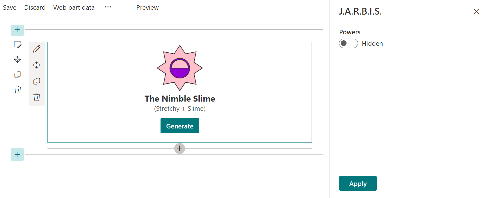

# Lab 11: Configurable Web Parts

So now we've got a web part that pulls hero configuration options from a provisioned list during the edit experience while utilizing caching. The web part lets you randomize the instance property values using those list items and uses those values to display a configured hero. Wowee!

In this lab, we'll clean up our property pane and make the web part configurable. We currently let some of the properties be overwritten there undermining (and humiliating) our generate button.

<details>
<summary><b>Legend</b></summary>

|Icon|Meaning|
|---|---|
|:rocket:|Exercise|
|:apple:|Mac specific instructions|
|:shield:|Admin mode required|
|:bulb:|Hot tip!|
|:hedgehog:|Code catch-up|
|:warning:|Caution!|
|:books:|Resources|

</details>

<details>
<summary><b>Exercises</b></summary>

  1. [End user view customization](#rocket-exercise-1-end-user-view-customization)
  1. [Reactive vs nonreactive](#rocket-exercise-2-reactive-vs-nonreactive)
</details>

<details>
<summary><b>Starter Code</b></summary>

If you skipped the previous step, or just want to start here, you can find the code ready to go in the [Lab 11 Starter](https://github.com/SPFxHeroes/JARBIS/tree/Start-of-Lab-11) branch.

</details>

## :rocket: Exercise 1: End user view customization

Our web part display is looking great. However, some user's have requested we give them the option to display the powers or not (nobody actually requested anything, we're just pretending. But it's fun!). So, let's make that configurable!

1. In your **JarbisWebPart.ts** file, add a new property to the `IJarbisWebPartProps` interface, make it of type `boolean` and call it `powersVisible`, by using the following code:

   ```TypeScript
   /**
    * Indicates if the hero's powers should be shown at render time.
    */
   powersVisible: boolean;
   ```

1. In **JarbisWebPart.manifest.json**, add a new default property under `preconfiguredEntries` and `properties`; call it `powersVisible` and make the default value `true` (no quotes needed). You can do so by adding the following JSON node (don't forget to add a comma on the line above):

   ```json
   "powersVisible": true
   ```

   The complete `properties` node in **JarbisWebPart.manifest.json** should look as follows:

   ```json
   "properties": {
     "name": "Lab Rat",
     "primaryPower": "Science",
     "secondaryPower": "Experiments",
     "foregroundColor": "orange",
     "backgroundColor": "skyblue",
     "foregroundIcon": "TestBeakerSolid",
     "backgroundIcon": "StarburstSolid",
     "list": "Powers",
     "powersVisible": true
   }
   ```
   > :bulb: Remember that if you don't stop serving, re-serve, and then remove and re-add your web part from the workbench, that you won't have the correct default value. Shouldn't break anything, but it could be confusing.

1. Back in the **JarbisWebPart.ts** file, in the `render` method above the `const generateButton...` line add the following code:

   ```TypeScript
   const powerSummary = `
      <div class="${styles.powers}">
        (${escape(this.properties.primaryPower)} + ${escape(this.properties.secondaryPower)})
      </div>`;
   ```

1. Still in the `render` method, replace the `const hero...` code with the following:

   ```typescript
   const hero = `
      <div class="${styles.logo}">
        <i class="${css(styles.background, getIconClassName(escape(this.properties.backgroundIcon)))}" style="color:${escape(this.properties.backgroundColor)};"></i>
        <i class="${css(styles.foreground, getIconClassName(escape(this.properties.foregroundIcon)))}" style="color:${escape(this.properties.foregroundColor)};"></i>
      </div>
      <div class="${styles.name}">
        The ${escape(this.properties.name)}
      </div>`;
   ```
  > :bulb: We just removed the list of powers from the default hero rendering

1. Again in the `render` method, just below the `${hero}` line, insert the following code:

   ```TypeScript
   ${this.properties.powersVisible ? powerSummary : ""}
   ```

   Making the full `render` method look as follows:

   ```TypeScript
   public render(): void {
    const oldbuttons = this.domElement.getElementsByClassName(styles.generateButton);
    for (let b = 0; b < oldbuttons.length; b++) {
      oldbuttons[b].removeEventListener('click', this.onGenerateHero);
    }

    if (this.displayMode === DisplayMode.Edit && this.powers === undefined) {
      this.context.statusRenderer.displayLoadingIndicator(this.domElement, 'options');

      //load the powers
      this.getPowers().catch((error) => console.error(error));
      return;
    } else {
      this.context.statusRenderer.clearLoadingIndicator(this.domElement);
    }

    const hero = `
      <div class="${styles.logo}">
        <i class="${css(styles.background, getIconClassName(escape(this.properties.backgroundIcon)))}" style="color:${escape(this.properties.backgroundColor)};"></i>
        <i class="${css(styles.foreground, getIconClassName(escape(this.properties.foregroundIcon)))}" style="color:${escape(this.properties.foregroundColor)};"></i>
      </div>
      <div class="${styles.name}">
        The ${escape(this.properties.name)}
      </div>`;

    const powerSummary = `
      <div class="${styles.powers}">
        (${escape(this.properties.primaryPower)} + ${escape(this.properties.secondaryPower)})
      </div>`;

    const generateButton = `<button class="${styles.generateButton}">Generate</button>`;

    this.domElement.innerHTML = `
      <div class="${styles.jarbis}">
        ${hero}
        ${this.properties.powersVisible ? powerSummary : ""}
        ${this.displayMode === DisplayMode.Edit ? generateButton : ""}
      </div>`;

    const buttons = this.domElement.getElementsByClassName(styles.generateButton);
    for (let b = 0; b < buttons.length; b++) {
      buttons[b].addEventListener('click', this.onGenerateHero);
    }
   }
   ```

   > :bulb: Now we can conditionally display the powers text, we just need a way to toggle it!

1. At the top of **JarbisWebPart.ts**, change the following `import` statement, from this:

   ```TypeScript
   import {
     type IPropertyPaneConfiguration,
     PropertyPaneTextField
   } from '@microsoft/sp-property-pane';
   ```

   To this:

   ```TypeScript
   import {
     type IPropertyPaneConfiguration,
     PropertyPaneToggle
   } from '@microsoft/sp-property-pane';
   ```
   > :bulb: We're no longer going to use the TextField control for the property pane and instead are going to use a Toggle control. You can explore what's available by typing PropertyPane and seeing what Intellisense suggests.
   >
   >PnP also provides a lot of controls to extend the property pane (like a list picker, people picker, term picker, color selector, etc.). You'll likely find what you need either in the standard controls or the PnP library, but you can actually build your own as well!

1. Replace the entire `getPropertyPaneConfiguration` method with the following code:

   ```TypeScript
   protected getPropertyPaneConfiguration(): IPropertyPaneConfiguration {
    return {
      pages: [
        {
          groups: [
            {
              groupFields: [
                PropertyPaneToggle('powersVisible', {
                  label: "Powers",
                  onText: "Visible",
                  offText: "Hidden"
                })
              ]
            }
          ]
        }
      ]
    };
   }
   ```

1. We've now temporarily stopped using the `strings` import and that will cause our build to fail thanks to some rather strict linting rules. Since we're going to be using this in the next lab, we can simply comment this import out for now:

   ```TypeScript
   //import * as strings from 'JarbisWebPartStrings';
   ```

1. Try configuring the web part to hide and show the powers by opening the property pane

   

If you run into any trouble or don't really want to do the steps above, you can just replace the entire contents of the **JarbisWebPart.ts** file with the following:

<details>
<summary>:hedgehog: JarbisWebPart.ts</summary>

```TypeScript
import { Version, DisplayMode } from '@microsoft/sp-core-library';
import {
  type IPropertyPaneConfiguration,
  PropertyPaneToggle
} from '@microsoft/sp-property-pane';
import { BaseClientSideWebPart } from '@microsoft/sp-webpart-base';
import type { IReadonlyTheme } from '@microsoft/sp-component-base';

import styles from './JarbisWebPart.module.scss';
//import * as strings from 'JarbisWebPartStrings';
import { getIconClassName } from '@fluentui/style-utilities';
import { css } from '@fluentui/utilities';
import { escape } from '@microsoft/sp-lodash-subset';
import { IPowerItem } from './IPowerItem';
import { spfi, SPFx } from '@pnp/sp';
import '@pnp/sp/webs';
import '@pnp/sp/lists';
import '@pnp/sp/items';
import { Caching } from '@pnp/queryable';

export interface IJarbisWebPartProps {
  name: string;
  primaryPower: string;
  secondaryPower: string;
  foregroundColor: string;
  backgroundColor: string;
  foregroundIcon: string;
  backgroundIcon: string;

  /**
   * The name of the SharePoint list that contains the powers.
   */
  list: string;

  /**
   * Indicates if the hero's powers should be shown at render time.
   */
  powersVisible: boolean;
}

export default class JarbisWebPart extends BaseClientSideWebPart<IJarbisWebPartProps> {

  private powers: IPowerItem[];

  public render(): void {
    const oldbuttons = this.domElement.getElementsByClassName(styles.generateButton);
    for (let b = 0; b < oldbuttons.length; b++) {
      oldbuttons[b].removeEventListener('click', this.onGenerateHero);
    }

    if (this.displayMode === DisplayMode.Edit && this.powers === undefined) {
      this.context.statusRenderer.displayLoadingIndicator(this.domElement, 'options');

      //load the powers
      this.getPowers().catch((error) => console.error(error));
      return;
    } else {
      this.context.statusRenderer.clearLoadingIndicator(this.domElement);
    }

    const hero = `
      <div class="${styles.logo}">
        <i class="${css(styles.background, getIconClassName(escape(this.properties.backgroundIcon)))}" style="color:${escape(this.properties.backgroundColor)};"></i>
        <i class="${css(styles.foreground, getIconClassName(escape(this.properties.foregroundIcon)))}" style="color:${escape(this.properties.foregroundColor)};"></i>
      </div>
      <div class="${styles.name}">
        The ${escape(this.properties.name)}
      </div>`;

    const powerSummary = `
      <div class="${styles.powers}">
        (${escape(this.properties.primaryPower)} + ${escape(this.properties.secondaryPower)})
      </div>`;

    const generateButton = `<button class="${styles.generateButton}">Generate</button>`;

    this.domElement.innerHTML = `
      <div class="${styles.jarbis}">
        ${hero}
        ${this.properties.powersVisible ? powerSummary : ""}
        ${this.displayMode === DisplayMode.Edit ? generateButton : ""}
      </div>`;

    const buttons = this.domElement.getElementsByClassName(styles.generateButton);
    for (let b = 0; b < buttons.length; b++) {
      buttons[b].addEventListener('click', this.onGenerateHero);
    }
  }

  /**
     * Gets the list of powers from SharePoint
     */
  private getPowers = async (): Promise<void> => {
    const sp = spfi().using(SPFx(this.context));

    // Get the list of powers from SharePoint using the name of the library specified in the property pane
    this.powers = await sp.web.lists.getByTitle(this.properties.list).items.select('Title', 'Icon', 'Colors', 'Prefix', 'Main').using(Caching())();

    // Re-render the web part
    this.render();
  }

  /**
   * Generates a new hero with random values
   *
   * @param _event Unused event parameter
   */
  public onGenerateHero = (_event: MouseEvent): void => {
    // Get a random power (list item) from the list of powers
    const power1 = this.getRandomItem(this.powers);

    // Get another random power (list item) from the list of powers, excluding the first power
    const power2 = this.getRandomItem(this.powers, power1);

    if (typeof power1 === 'undefined' || typeof power2 === 'undefined') {
      console.error("Unable to get powers");
      return;
    }

    // Get the titles from each of the powers and save them to our properties
    this.properties.primaryPower = power1.Title;
    this.properties.secondaryPower = power2.Title;

    // Get a random color for the background choosing from the combined color suggestions for the two powers
    this.properties.backgroundColor = this.getRandomItem([...power1.Colors, ...power2.Colors]) ?? this.properties.backgroundColor;
    // Get a random color for the foreground choosing from the same list of suggestions but excluding the background color
    this.properties.foregroundColor = this.getRandomItem([...power1.Colors, ...power2.Colors], this.properties.backgroundColor) ?? this.properties.foregroundColor;

    // Get a random icon for the background choosing from a fixed list of background icons
    this.properties.backgroundIcon = this.getRandomItem(['StarburstSolid', 'CircleShapeSolid', 'HeartFill', 'SquareShapeSolid', 'ShieldSolid']) ?? this.properties.backgroundIcon;
    // Get a random icon for the foreground choosing from the combined icon suggestions for the two powers
    this.properties.foregroundIcon = this.getRandomItem([...power1.Icon, ...power2.Icon], this.properties.backgroundIcon) ?? this.properties.foregroundIcon;

    // Get the prefix choosing from the combined prefix suggestions for the two powers
    const prefix = this.getRandomItem([...power1.Prefix, ...power2.Prefix]);
    // Get the main portion of the name by choosing from the combined main suggestions
    //  for the two powers excluding the prefix since there is some overlap
    const main = this.getRandomItem([...power1.Main, ...power2.Main], prefix);

    // Store the name of the hero by combining the prefix with the main
    this.properties.name = prefix + ' ' + main;

    // Re-render the web part
    this.render();
  }

  /**
   * Gets a random value from an array of choices, excluding a specific value
   *
   * @param choices The array of choices to pick from
   * @param exclusion The value to exclude from the choices
   */
  private getRandomItem = <T>(choices: T[], exclusion?: T): T | undefined => {
    // Filter the choices to exclude the previous value
    const filteredChoices = choices.filter((value) => value !== exclusion);

    // If there are any choices left, pick a random one
    if (filteredChoices.length) {
      return filteredChoices[Math.floor(Math.random() * filteredChoices.length)];
    }

    // Otherwise, return undefined
    return;
  }

  protected onDispose(): void {
    const oldbuttons = this.domElement.getElementsByClassName(styles.generateButton);
    for (let b = 0; b < oldbuttons.length; b++) {
      oldbuttons[b].removeEventListener('click', this.onGenerateHero);
    }
  }

  protected onThemeChanged(currentTheme: IReadonlyTheme | undefined): void {
    if (!currentTheme) {
      return;
    }

    const {
      semanticColors
    } = currentTheme;

    if (semanticColors) {
      this.domElement.style.setProperty('--bodyText', semanticColors.bodyText || null);
      this.domElement.style.setProperty('--link', semanticColors.link || null);
      this.domElement.style.setProperty('--linkHovered', semanticColors.linkHovered || null);
    }

  }

  protected get dataVersion(): Version {
    return Version.parse('1.0');
  }

  protected getPropertyPaneConfiguration(): IPropertyPaneConfiguration {
    return {
      pages: [
        {
          groups: [
            {
              groupFields: [
                PropertyPaneToggle('powersVisible', {
                  label: "Powers",
                  onText: "Visible",
                  offText: "Hidden"
                })
              ]
            }
          ]
        }
      ]
    };
  }
}

```

</details>


#### :books: Resources
- [SPFx property pane overview](https://learn.microsoft.com/en-us/sharepoint/dev/spfx/web-parts/guidance/integrate-web-part-properties-with-sharepoint)
- [PnP SPFx Property Controls](https://pnp.github.io/sp-dev-fx-property-controls/)
- [Build custom controls for the property pane](https://learn.microsoft.com/en-us/sharepoint/dev/spfx/web-parts/guidance/build-custom-property-pane-controls)


## :rocket: Exercise 2: Reactive vs nonreactive

You may have noticed that changes to the property pane are immediately reflected in the web part. This is because SPFx web parts are Reactive by default. However, there may be times when you may not wish to automatically re-render the web part (for example, if a setting requires a significant amount of processing or external calls or if you have some settings that must all be filled out together). In those cases, you wouldn't want your property changes to immediately fire but rather have them all applied at once.

To disable reactive property panes, you simply need to add the following code above the `getPropertyPaneConfiguration` method:

  ```TypeScript
  protected get disableReactivePropertyChanges(): boolean { 
    return true; 
  }
  ```

1. Test your web part again: you should see a new **Apply** button at the bottom of the property pane. Pressing it should cause the changes you made to the settings to re-render the web part.

   

1. Having our hero generator be nonreactive for a single property doesn't make a lot of sense. We just wanted you to be aware of how to do it. So, when you're done testing, remove the `disableReactivePropertyChanges` code we just made you add.

1. Do a dance

#### :books: Resources
- [Reactive and nonreactive SharePoint web parts](https://learn.microsoft.com/en-us/sharepoint/dev/design/reactive-and-nonreactive-web-parts)

## :tada: All Done!


In our next lab, we'll dive into localization or as the French call it Le Localizazeehon (probably, I don't know French).

# [Previous](../Lab10/README.md) | [Next](../Lab12/README.md)
