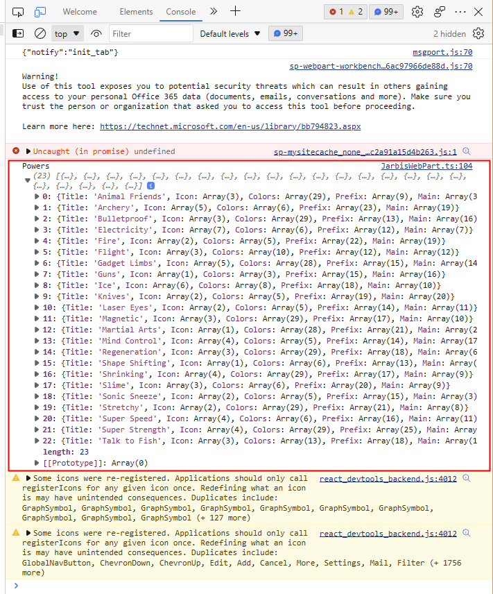
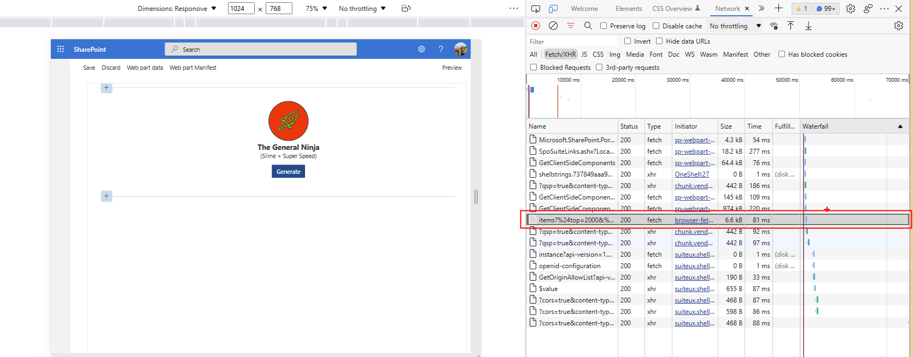
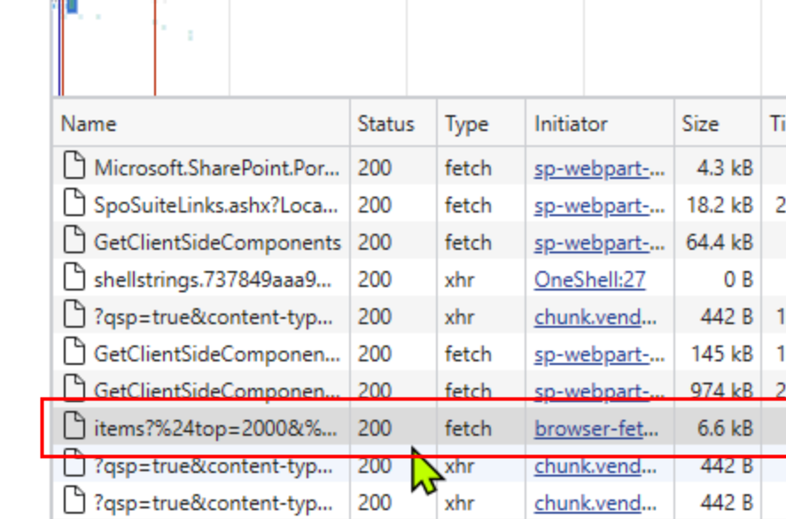

# Lab 9

In this lab, we'll retrieve data from the SharePoint list that we deployed when the solution was deployed to a site.

To make retrieving data easier, we'll use [PnPjs]}(https://pnp.github.io/pnpjs/) to retrieve the data.

PnPjs is a collection of fluent libraries for consuming SharePoint, Graph, and Office 365 REST APIs in a type-safe way. You can use it within SharePoint Framework, Nodejs, or any JavaScript project.

## Exercise 1

1. In VSCode, add a new file named **IPowerItem.ts** in the same folder as **JarbisWebPart.ts**
1. Paste the following code into the newly-created file:

    ```typescript
    /**
    * A record from the "Powers" SharePoint list.
    *
    * Represents a single record retrieved from the "Powers" SharePoint list, with properties for each of the columns in the list.
    *
    * @export
    * @interface IPowerItem
    */
    export interface IPowerItem {
           /**
         * The title of the power.
         *
         * This is the title of the record in the SharePoint list.
         *
         * @type {string}
         * @memberof IPowerItem
            */
           Title: string;
    
           /**
         * The supported colors for the power.
         *
         * This is the list of colors that will work well with this power.
         * @type {string[]}
         * @memberof IPowerItem
            */
           Colors: string[];
    
           /**
         * The icons for the power.
         *
         * This is the list of potential icons that can be used for this power.
         *
         * @type {string[]}
         * @memberof IPowerItem
            */
           Icon: string[];
    
           /**
         * The main text for the power.
         *
         * Contains a list of potential main text for the power.
         *
         * @type {string[]}
         * @memberof IPowerItem
            */
           Main: string[];
    
           /**
         * The prefix for the power.
         *
         * Contains a list of potential prefixes (e.g. Captain, Doctor, etc.) for the power.
         *
         * @type {string[]}
         * @memberof IPowerItem
            */
           Prefix: string[];
    }
    ```

    > You'll notice that we're starting to add comments to our code; this is not only to teach you how the code works as you're using it in the labs, but also to impart some coding best-practices.
    >
    > The weird comment syntax (`/**` and `*/`) we're using follows the [JSDoc](https://www.typescriptlang.org/docs/handbook/jsdoc-supported-types.html) convention, which VSCode recognizes and will use to provide tooltips as you refer the `IPowerItem` interface throughout the code.
    >
    > Neato!!!

1. Back in **JarbisWebPart.ts**, add an import to the newly-created `IPowerItem` interface by appending the following code at the bottom of all the `import` statements:

        ```typescript
        import { IPowerItem } from './IPowerItem';
        ```

 1. Try to hover your mouse over `IPowerItem` in the line you just added; you should see that the comments from the `IPowerItem` interface are reflected in the tooltips.
 1. Inside the `JarbisWebPart` class, above the `render` method, add a variable to store an array of `IPowerItem` after they have been loaded from SharePoint by adding the following code:

        ```typescript
        private _powers: IPowerItem[];
        ```

## Exercise 2

1. Using the terminal, add the required PnPjs modules to your solution by typing the following command:

    ```bash
    npm install @pnp/sp
    ```

    > Note: you may have to stop serving your web part in order to run `npm install`
    > 
    > Note that, unlike the previous times we ran the `npm install` command, we omitted the `-g` parameter, because the `-g` parameter means that we want to install the node module _globally_ (i.e.: at the Operating System level); without the `-g` parameter, the node module will be installed _locally_ (i.e.: at the solution-level).
    >
    > This is because we need the `@pnp/sp` module for our solution only, not for all solutions on our system.

1. Add the following `import` statements to the top of **JarbisWebPart.ts**, below the `import {IPowerItem }` line:

    ```typescript
    import { spfi, SPFx } from '@pnp/sp';
    import '@pnp/sp/webs';
    import '@pnp/sp/lists';
    import '@pnp/sp/items';
    import "@pnp/sp/items/get-all";
    ```

    > You may wonder why adding PnPjs requires adding so many imports. The answer is simple: PnPjs provides a _lot_ of functionality, but we don't need to use _every_ single feature provided by the PnPjs -- otherwise the codebase for your web part would be a lot bigger and would make SharePoint page where someone added your web part render very slowly and appear sluggish.
    >
    > By importing _only_ the features we need (i.e. SharePoint, webs, lists, list items, and the `getAll` function), we help keep the web part code base as and dependencies as small as possible.

1. After the `render` method, add the following method to retrieving the list of powers from SharePoint: 

    ```typescript
      /**
      * Gets the list of powers from SharePoint
      *
      * @private
      * @memberof JarbisWebPart
      */
      private getPowers = async (): Promise<void> => {
        const sp = spfi().using(SPFx(this.context));
    
        // Get the list of powers from SharePoint using the name of the library specified in the property pane
        this._powers = await sp.web.lists.getByTitle(this.properties.list).items.select('Title', 'Icon', 'Colors', 'Prefix', 'Main').getAll();

        console.log("Powers", this._powers);
      }
    ```

1. In the `IJarbisWebPartProps` interface, add a string property called `list`, which will store the name of the list where powers will be retrieved from by adding the following code:

   ```typescript
   // The name of the SharePoint list that contains the powers
   list: string;
   ```

    The code for `IJarbisWebPartProps` should look as follows:

    ```typescript
    export interface IJarbisWebPartProps {
      name: string;
      primaryPower: string;
      secondaryPower: string;
      foregroundColor: string;
      backgroundColor: string;
      foregroundIcon: string;
      backgroundIcon: string;
      
      // The name of the SharePoint list that contains the powers
      list: string;
    }
    ```

1. In the `render` method, find the `if ... else` statement and add the following code to load the list of powers before the `return` statement -- above the `else` block:

    ```typescript
    //load the powers
    this.getPowers().catch((error) => console.error(error));
    ```

    The new code should look as follows:

    ```typescript
    if (this.displayMode === DisplayMode.Edit &&  this._powers === undefined) {
      this.context.statusRenderer.displayLoadingIndicator(this.domElement, 'options');

      //load the powers
      this.getPowers().catch((error) => console.error(error));
      return;
    } else {
      this.context.statusRenderer.clearLoadingIndicator(this.domElement);
    }
    ```

1. In **JarbisWebPart.manifest.json**, add a new default property under `preconfiguredEntries` and `properties`; call it `list` and make the default value `Powers`. You can do so by adding the following JSON node (don't forget to add a comma on the line above):

   ```json
   "list": "Powers"
   ```

    The complete `properties` node in **JarbisWebPart.manifest.json** should look as follows:

    ```json
    "properties": {
      "name": "Lab Rat",
      "primaryPower": "Science",
      "secondaryPower": "Experiments",
      "foregroundColor": "orange",
      "backgroundColor": "skyblue",
      "foregroundIcon": "TestBeakerSolid",
      "backgroundIcon": "StarburstSolid",
      "list": "Powers"
    }
    ```

1. Try running `gulp serve --nobrowser` and remove the **Jarbis** web part, refresh the page and re-add the web part.
   
   The web part will load but never seem to stop loading. However, if you change the workbench from **Edit** mode to **Preview** mode, you'll see that the web part renders properly.

   This is because the web part does not re-render once the data is loaded!

1. Let's fix the issue by adding a call to the web part's `render` method at the end of the `getPowers`, after the data is loaded, with this code:
   
   ```typescript
   // Re-render the web part
   this.render();
   ```

   Making the complete `getPowers` code look as follows:

   ```typescript
     /**
       * Gets the list of powers from SharePoint
       *
       * @private
       * @memberof JarbisWebPart
       */
    
      private getPowers = async (): Promise<void> => {
        const sp = spfi().using(SPFx(this.context));
    
        // Get the list of powers from SharePoint using the name of the library specified in the property pane
        this._powers = await sp.web.lists.getByTitle(this.properties.list).items.select('Title', 'Icon', 'Colors', 'Prefix', 'Main').getAll();

        console.log("Powers", this._powers);

        // Re-render the web part
        this.render();
      }
   ```

1. Refresh the web part while the workbench is in **Edit** mode and you should see the web part render once the data has been loaded. Depending on how fast things render, you may not even notice the loading spinner.
1. If you use your web browser's dev tools, you'll find that the web part adds a message to the console that shows the data retrieved from the list.
     

## Exercise 3

You may have noticed that we query the list of Powers every single time that we render the web part -- which may be a little overkill when the list of choices is not expected to change all that much.

Luckily, PnPjs has built-in support for caching, and will automatically refresh the cache when needed.

1. Start by testing the web part without caching: using your browser's developer tools, show the **Network** tab and filter for **Fetch / XHR** requests -- which are the types of network calls your web part makes when retrieving items from the list.
     
1. Refresh the workbench page
1. In the list of network calls made by the page, look for a call to the `items` API
   

     

1. Refresh the page several times, making sure to note that the `items` API is called every time. Also, note how much time the call takes every time.

1. Return to your web part code and add the following import:

   ```typescript
   import { Caching } from "@pnp/queryable";
   ```

1. Change the `this._powers` line in the `getPowers` method to use the following code instead:

   ```typescript
     // Get the list of powers from SharePoint using the name of the library specified in the property pane
    this._powers = await sp.web.lists.getByTitle(this.properties.list).items.select('Title', 'Icon', 'Colors', 'Prefix', 'Main').using(Caching()).getAll();
   ```

1. Refresh the web part. You may not notice a difference, but the web part only queries the list _once_ -- unless there are changes or the cache has expired.
1. To verify that the cache is used, look for a call to the `items` API in the network calls; the first time you load the web part, you should see a call to it, but refreshing the page should not cause the web part to call the API every subsequent time.

We have improved performance we caching, but the web part always renders the same hero badge, regardless of what data is loaded, because it never uses the data that we loaded ... but we'll fix that in our next lab.